# 📊 E-Commerce Business Analytics

End-to-end Data Analytics project that transforms raw e-commerce order data into actionable business insights using **SQL**, **Python**, and **Power BI**.

---

## 📌 Project Overview

This project analyzes 5,500 orders (9,300+ order lines) from 2022–2025 to answer key business questions related to revenue, profitability, product performance, discount impact, return rates, customer ratings, and regional performance.

The complete pipeline follows a real-world data analyst workflow:

**SQL → Python (Pandas + Matplotlib) → Power BI Dashboard**

---

## 🛠️ Tools & Technologies

- **SQL (MySQL)** – Data extraction and business analysis
- **Python** – Data cleaning, exploratory data analysis (EDA), and visualization
- **Pandas & NumPy** – Data manipulation
- **Matplotlib & Seaborn** – Charts and visual insights
- **Power BI** – Interactive E-Commerce Dashboard
- **Git & GitHub** – Version control and project showcase

---

## ✨ Key Features

- Overall KPIs (Revenue, Profit, Margin, Orders, Customers, Return Rate, Avg Rating)
- Category & Product performance analysis
- Discount impact on sales and profitability
- Return rate analysis by category
- Customer and regional performance
- Delivery / Ship Mode analysis
- Interactive Power BI Dashboard with multiple pages

---

## 📈 Key Insights

- Electronics and Sports generate the highest revenue
- Higher discounts significantly reduce profit margins
- Clothing and Beauty show higher return rates
- Clear monthly seasonality in revenue
- Faster delivery modes are associated with better customer ratings
- A small set of products contributes a large share of total profit

---

## 📁 Project Structure

```
ECommerce-Business-Analytics/
├── data/
│   ├── customers.csv
│   ├── products.csv
│   ├── orders.csv
│   └── summaries/
├── sql/
│   ├── 01_schema_and_load.sql
│   └── 02_analysis_queries.sql
├── python/
│   ├── 01_ecommerce_analysis.py
│   └── charts/
├── powerbi/
│   └── ECommerce_Business_Analytics_Dashboard.pbix
├── docs/
│   └── PowerBI_Dashboard_Guide.md
├── images/
│   ├── sql/
│   ├── python/
│   └── powerbi/
├── requirements.txt
└── README.md
```

---

## 🚀 How to Run the Project

### 1. SQL Analysis (MySQL)
- Create the database and tables using `sql/01_schema_and_load.sql`
- Import `data/customers.csv`, `data/products.csv`, and `data/orders.csv`
- Run the analysis queries from `sql/02_analysis_queries.sql`

### 2. Python Analysis
```bash
pip install -r requirements.txt
python python/01_ecommerce_analysis.py
```

### 3. Power BI Dashboard
- Open `powerbi/ECommerce_Business_Analytics_Dashboard.pbix` in Power BI Desktop
- Or follow the step-by-step guide in `docs/PowerBI_Dashboard_Guide.md`

---

## 📊 Dashboard Pages (Power BI)

1. **Executive Overview** – KPIs, trends, category performance  
2. **Product & Category Analysis** – Best products, returns, margins  
3. **Discount Impact** – Effect of discounts on profitability  
4. **Customers, Region & Delivery** – Customer value, regions, shipping  

---

## 🖼️ Screenshots

### Power BI Dashboard
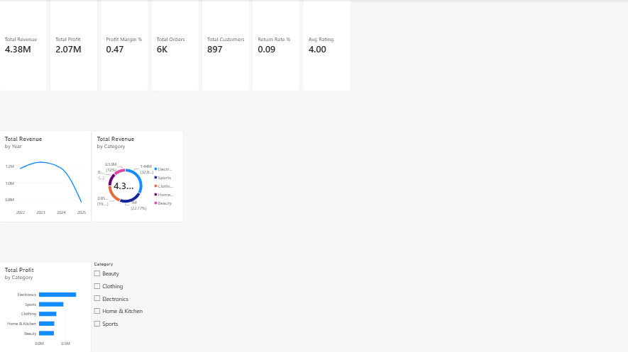
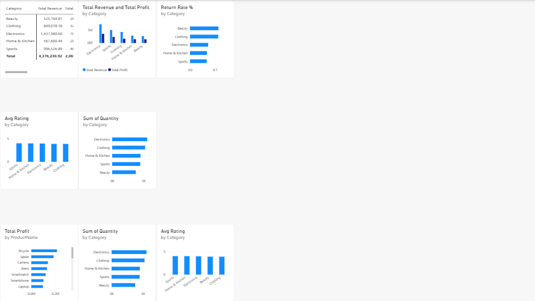
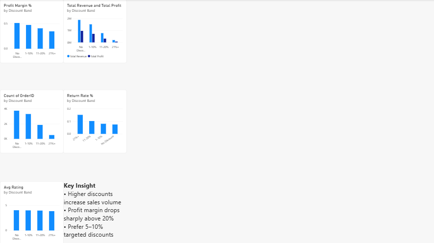
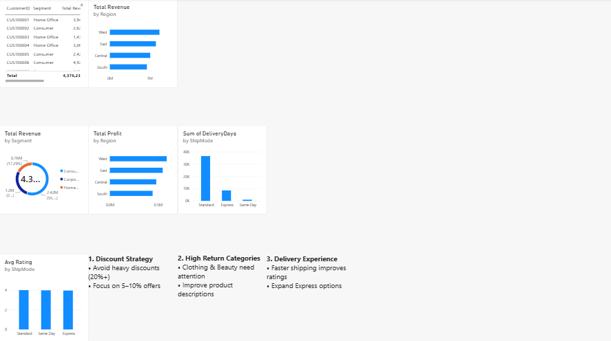

### SQL Analysis
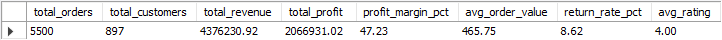
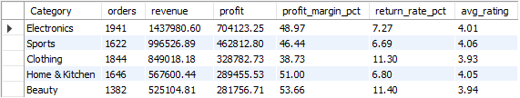
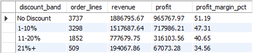
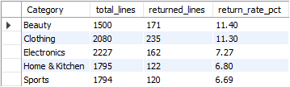
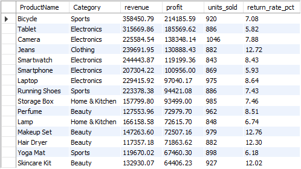
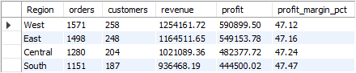

### Python Visualizations
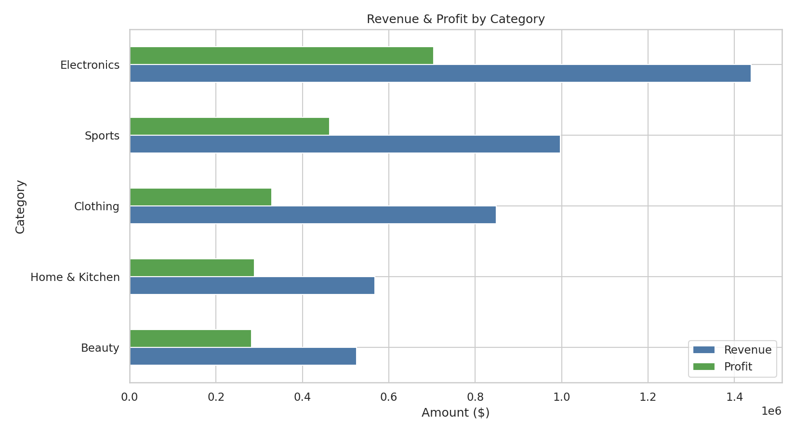
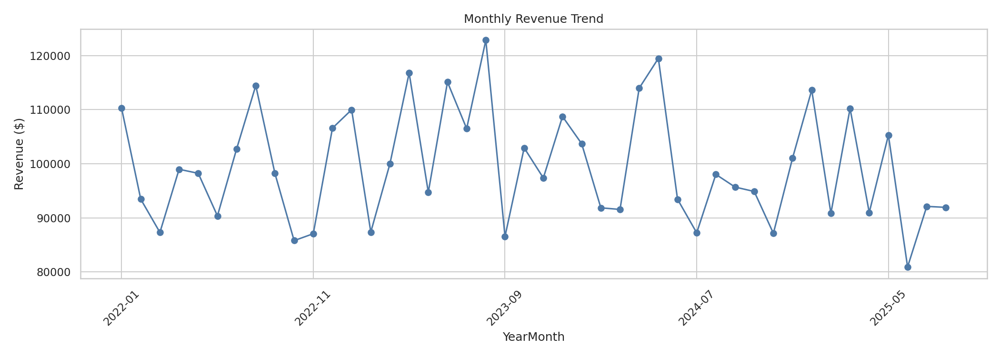
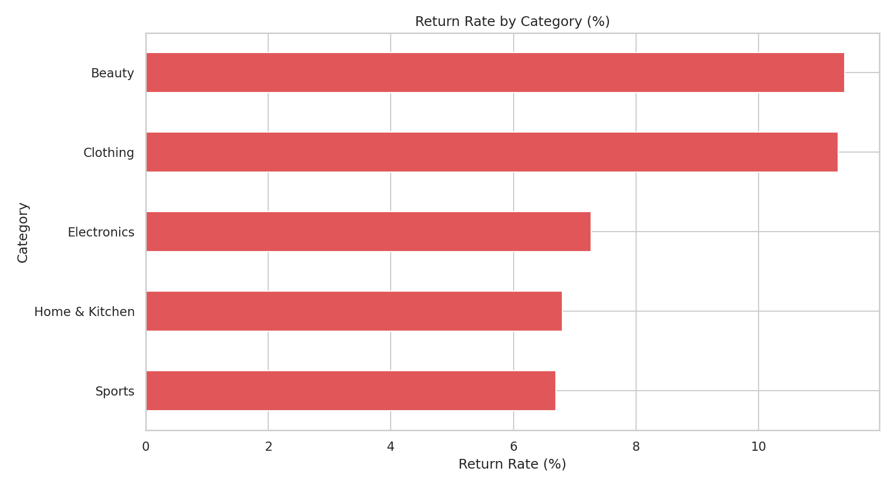
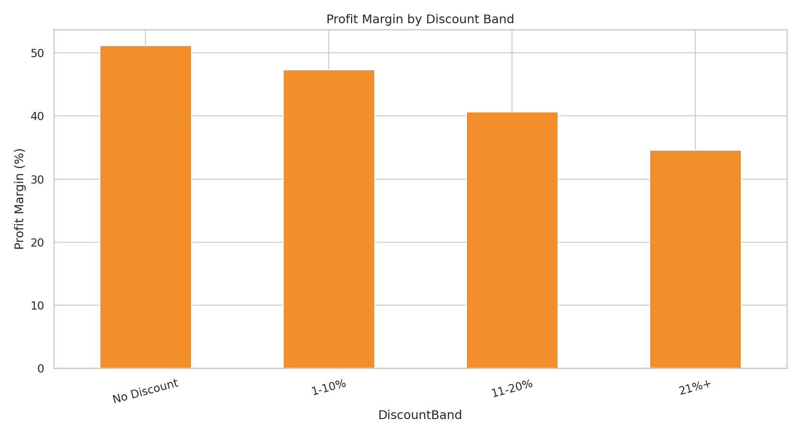
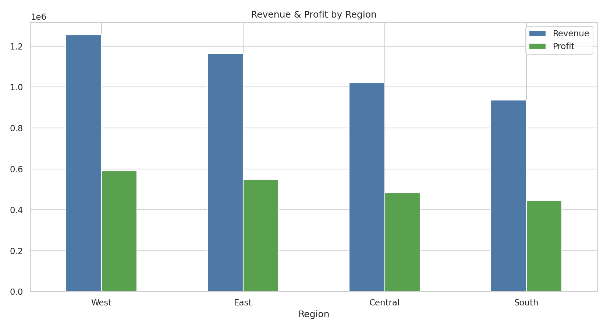
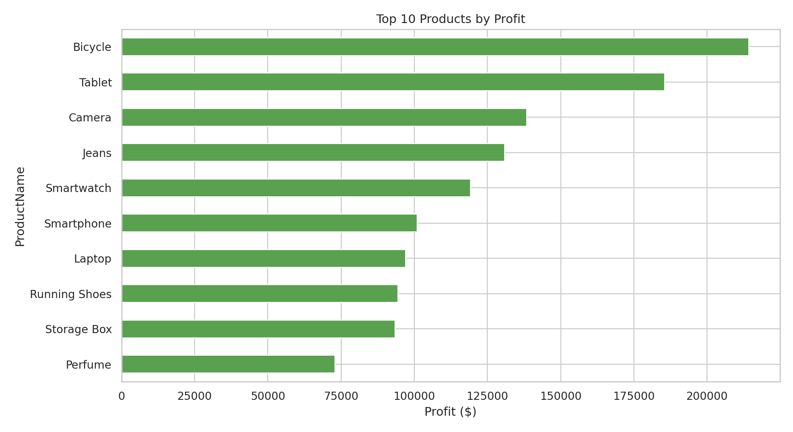

---

## 👤 Author

**Mubeen Salman**  
Aspiring Data Analyst  

- LinkedIn: [https://www.linkedin.com/in/mubeen-salman-459776364/]  
- GitHub: [https://github.com/MuhammadMubeen04]  

---

## 📄 License

This project is for educational and portfolio purposes.
